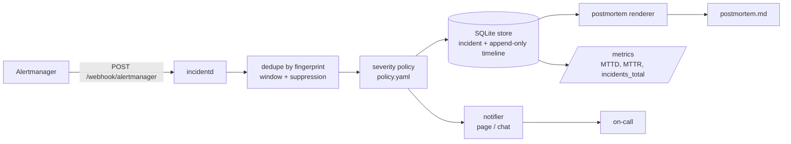

# incident-response-automation

Turns Alertmanager webhook deliveries into managed incidents: fingerprint dedupe, a severity
policy read from YAML, an append-only timeline, MTTD/MTTR metrics and a blameless postmortem draft.

[](https://github.com/dayxus/incident-response-automation/actions/workflows/ci.yml)
[](LICENSE)
[](pyproject.toml)

## What it does

- Accepts the standard Alertmanager webhook payload at `POST /webhook/alertmanager` and answers
  with `{incident_id, status, deduplicated}`; re-delivering the same payload never opens a second
  incident.
- Deduplicates by fingerprint with a configurable window and a suppression window that reopens the
  same incident when an alert flaps instead of paging twice.
- Classifies every alert with `policy/policy.yaml`: service tier + alert severity decide Sev1–Sev4,
  owner, notification route and ack/resolve deadlines — data, not code.
- Keeps an append-only timeline per incident (opened, alert received, notified, acknowledged,
  resolved, reopened) and derives MTTD, MTTR, ack-deadline state and Prometheus series from it.
- Renders a blameless postmortem in markdown: real timeline, contributing factors from the alert
  annotations, an empty action-item table and explicit `<!-- preencher: ... -->` markers for the
  parts only humans can fill.
- Ships an offline `replay` path so a whole incident can be reproduced from stored payloads.

## Why it matters for SRE

Alert-to-incident handoffs are where toil and drift live: someone copies alert details into a
document, someone else guesses how long the incident lasted. Making the transition part of the
system keeps MTTD/MTTR honest (they come from the recorded timeline, not from memory), keeps ack
promises measurable against SLO-based severity, and hands the responder a draft that already
contains the evidence — so the postmortem discussion is about root cause instead of about
reconstructing what happened.

## Architecture



## Quickstart

```bash
git clone https://github.com/dayxus/incident-response-automation.git
cd incident-response-automation
make setup                  # .venv + runtime and dev requirements
make test                   # pytest with coverage
make demo                   # boots the API, delivers examples/, prints the postmortem
```

The demo needs nothing but the local machine: it binds `127.0.0.1:8099`, uses the stdout notifier
and writes its artifacts to `var/demo/`.

Offline (no HTTP, no network):

```bash
.venv/bin/python -m incidentd replay --dir examples/alertmanager --db var/incidents.db --json
.venv/bin/python -m incidentd postmortem --id INC-2026-0001 --db var/incidents.db
.venv/bin/python -m incidentd list --db var/incidents.db --severity Sev1
```

## Verify it yourself

```bash
make test
```

```
101 passed in 2.63s
TOTAL                      1342     73    276     36    93%
```

```bash
PYTHON=$PWD/.venv/bin/python bash scripts/demo.sh | sed -n '1,30p'
```

```
incidentd demo — synthetic incident 2026-03-04 (see examples/playbook/README.md)
server: http://127.0.0.1:8099  database: /Users/jefersonmelo/.../var/demo/incidents.db
healthz: {"status":"ok","version":"0.1.0"}

1. Alertmanager deliveries
  01-firing-checkout-api.json -> incident=INC-2026-0001 status=open deduplicated=false action=create severity=Sev1 service=checkout-api
  02-firing-checkout-api-repeat.json -> incident=INC-2026-0001 status=open deduplicated=true action=attach severity=Sev1 service=checkout-api

2. Operator acknowledgement of INC-2026-0001 (recorded at 2026-03-04T13:06:10Z, deadline 5m)
  status=acknowledged mttd=240.0s mttd_state=met owner=primary-oncall route=page-primary

3. The other services keep failing while INC-2026-0001 is acknowledged
  03-firing-search-api.json -> incident=INC-2026-0002 status=open deduplicated=false action=create severity=Sev3 service=search-api
  05-firing-payments-worker.json -> incident=INC-2026-0003 status=open deduplicated=false action=create severity=Sev1 service=payments-worker
  04-resolved-checkout-api.json -> incident=INC-2026-0001 status=resolved deduplicated=false action=resolved severity=Sev1 service=checkout-api

4. Incidents in the store
ID             STATUS    SEV   SERVICE          OWNER           OPENED                MTTD  MTTR
-------------  --------  ----  ---------------  --------------  --------------------  ----  ----
INC-2026-0003  open      Sev1  payments-worker  primary-oncall  2026-03-04T13:09:30Z  n/a   n/a
INC-2026-0002  open      Sev3  search-api       search-oncall   2026-03-04T13:07:00Z  n/a   n/a
INC-2026-0001  resolved  Sev1  checkout-api     primary-oncall  2026-03-04T13:02:10Z  4m    47m

3 incident(s)
```

The postmortem the same run generated (`var/demo/postmortem.md`, printed by `scripts/demo.sh`):

```
# Postmortem — checkout-api (Sev1)

_Blameless: the goal is to find the systemic gap, not the person closest to it._

## Metadata

| Field | Value |
| --- | --- |
| Incident | INC-2026-0001 |
| Severity | Sev1 |
| Service | checkout-api |
| Owner | primary-oncall |
| Route | page-primary via pagerduty-primary, escalation after 5m |
| Status | resolved |
| SLO | checkout-availability-99.95 |
| Opened at | 2026-03-04T13:02:10Z |
| Acknowledged at | 2026-03-04T13:06:10Z (MTTD 4m) |
| Resolved at | 2026-03-04T13:49:10Z (MTTR 47m) |
| Ack deadline | 5m (met) |
| Fingerprint | 4a7d9eb30581fff8 |
| Policy | policy/policy.yaml |

## Summary

checkout-api is burning the availability SLO budget

5m error-budget burn rate 14.2 on checkout-availability-99.95; p99 latency 1.8s vs 400ms target, 3.1% of checkout requests failing.

## Impact

- Severity: **Sev1** (policy rule `critical-tier1`)
- Blast radius: service `checkout-api`, SLO `checkout-availability-99.95`
- Alerts received for this fingerprint: **2**
- Time in degraded state: **47m**
<!-- preencher: usuários/serviços afetados, volume e janela de impacto -->

## Detection

- Detected by the Alertmanager webhook delivery that opened the incident at 2026-03-04T13:02:10Z
- Acknowledged by oncall-alice at 2026-03-04T13:06:10Z (MTTD 4m)
<!-- preencher: como o problema foi detectado (alerta, cliente, deploy) -->

## Timeline

_All entries come from the append-only incident timeline._

- 2026-03-04T13:02:10Z · `opened` · alertmanager — incident opened from LatencySLOBurn (Sev1 owner=primary-oncall route=page-primary (pagerduty-primary, escalate after 5m), policy rule critical-tier1)
- 2026-03-04T13:06:10Z · `acknowledged` · oncall-alice — acknowledged by oncall-alice (within the 5m ack deadline)
- 2026-03-04T13:49:10Z · `resolved` · alertmanager — resolved by alertmanager
- 2026-03-04T13:49:10Z · `notified` · notifier — notified pagerduty-primary (resolved)
- 2026-09-16T00:52:02Z · `alert_received` · alertmanager — alert firing delivered (startsAt 2026-03-04T13:02:10Z)
- 2026-09-16T00:52:02Z · `notified` · notifier — notified pagerduty-primary (page)
- 2026-09-16T00:52:02Z · `alert_received` · alertmanager — duplicate alert delivery: duplicate delivery within the 600s dedupe window
- 2026-09-16T00:52:02Z · `alert_received` · alertmanager — resolved notification received from Alertmanager

## Contributing factors

- slow-path recommendation call enabled for all traffic (feature flag rollout at 12:58)

## Root cause

<!-- preencher: causa raiz — o que mudou no sistema/comportamento humano -->

## What went well

<!-- preencher: o que funcionou bem na resposta -->

## Action items

<!-- preencher: uma linha por ação, com tipo (prevent/detect/mitigate), owner e prazo. Sem ação mecânica como "ter mais cuidado" -->

| Action | Type | Owner | Due | Issue |
| --- | --- | --- | --- | --- |

---

Generated by `incidentd` from incident `INC-2026-0001` (fingerprint `4a7d9eb30581fff8`). Machine-filled fields are exact; every `preencher` marker is for the humans.
```

Two things worth reading carefully in that output. The `alert_received` entries carry the wall
clock of the replay (the delivery really did arrive now); the incident's own timestamps come from
the payload clocks (`startsAt` / `endsAt`), which is what makes MTTR reproducible — 2820s here.
And the incident was acknowledged at 13:06:10, inside the 5-minute deadline the policy set for a
tier-1 Sev1, so the postmortem reports the deadline as met.

## Automated maintenance

`.github/workflows/maintenance.yml` runs every Monday at 06:17 UTC (and on demand):

- `pip-audit` over `requirements.txt`; when it reports a vulnerability the workflow opens an issue
  containing the literal report.
- Validates every payload in `examples/alertmanager/` against
  `schemas/alertmanager-webhook.schema.json` and checks that each declared fingerprint equals the
  SHA-256 of its sorted label set — the rule Alertmanager itself uses, so a hand-edited fixture
  cannot silently stop deduplicating.
- Resolves the latest Alertmanager release, extracts the JSON fields of the webhook `Message`
  struct (plus the embedded `template.Data`) from that tag and rewrites the schema when upstream
  drifts, committing `chore(schema): sync alertmanager webhook schema`.
- Runs the extended idempotency suite: the same fingerprint delivered 1000 times, then fails the
  run unless exactly one incident exists and every extra delivery was absorbed. Latency percentiles
  go to `reports/weekly-audit.md`, which is committed only when the file actually changed.

## Project layout

```
incidentd/
  api.py            FastAPI routes (webhook, incidents, ack/resolve, postmortem, metrics, health)
  service.py        orchestration: ingest, transitions, metrics, postmortem
  store.py          SQLite persistence, append-only timeline, metrics snapshot
  dedupe.py         fingerprint grouping, dedupe and suppression windows
  severity.py       labels + policy -> Sev1..Sev4, owner, route, deadlines
  postmortem.py     markdown renderer with human-fill markers
  notify.py         Notifier interface: stdout, null, webhook
  metrics.py        Prometheus text exposition
  config.py         policy.yaml loader and validation
  models.py         Incident, AlertEvent, TimelineEntry, AlertmanagerWebhook
  cli.py            serve | replay | list | postmortem | metrics
policy/policy.yaml          severity rules, routes, tiers, dedupe windows
examples/alertmanager/*.json  5 real-format payloads (firing, retry, resolved)
examples/playbook/README.md   narrative of the synthetic incident
schemas/                    Alertmanager webhook JSON Schema
scripts/demo.sh             end-to-end demo: boot, deliver, print postmortem
scripts/validate_payloads.py   schema + fingerprint validation for the fixtures
scripts/sync_schema.py      schema drift check against the latest Alertmanager release
scripts/idempotency_audit.py   1000-delivery idempotency run and latency report
reports/weekly-audit.md     latest audit numbers
tests/                      101 tests, no network: injected notifier and in-process TestClient
docs/                       lifecycle, policy reference, postmortem template, versions
```

## Limitations and next steps

- SQLite with one writer: fine for a lab or a single team, not for a fleet of concurrent
  responders. PostgreSQL and a migration path are the next step.
- The API has no authentication — it is meant to sit behind a reverse proxy that terminates TLS and
  authenticates Alertmanager. Nothing here is a hardened internet-facing service.
- Delivery timestamps come from the receiving clock while incident timestamps come from the
  payload; the two can differ (see the timeline above). Normalising on the payload clock during
  ingest would remove the mismatch.
- Notifications are stdout, null or a single webhook URL. There is no de-duplicated escalation
  ladder, no acknowledgement from chat/pager, no on-call schedule lookup.
- Action items are intentionally empty: the tool drafts evidence, it does not invent follow-ups.
- No container image, no Kubernetes manifests, no OpenTelemetry traces; MTTR measures the alert
  lifecycle, not the customer-visible outage.

---

[README em português](README.pt-BR.md)

Part of the [dayxus SRE portfolio](https://github.com/dayxus).
