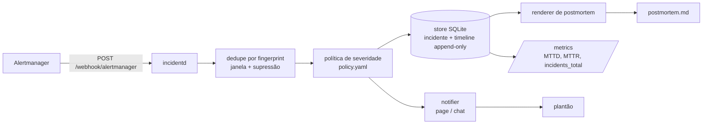

# incident-response-automation

Transforma entregas de webhook do Alertmanager em incidentes gerenciados: dedupe por fingerprint,
política de severidade lida de YAML, timeline append-only, métricas de MTTD/MTTR e rascunho de
postmortem blameless.

[](https://github.com/dayxus/incident-response-automation/actions/workflows/ci.yml)
[](LICENSE)
[](pyproject.toml)

## O que faz

- Recebe o payload padrão do Alertmanager em `POST /webhook/alertmanager` e responde
  `{incident_id, status, deduplicated}`; reenviar o mesmo payload nunca abre um segundo incidente.
- Deduplica por fingerprint com janela configurável e janela de supressão que reabre o mesmo
  incidente quando o alerta oscila, em vez de paginar duas vezes.
- Classifica cada alerta com `policy/policy.yaml`: tier do serviço + severidade do alerta decidem
  Sev1–Sev4, owner, rota de notificação e prazos de ack/resolve — é dado, não código.
- Mantém timeline append-only por incidente (opened, alert received, notified, acknowledged,
  resolved, reopened) e deriva MTTD, MTTR, estado do prazo de ack e séries Prometheus dela.
- Gera um postmortem blameless em markdown: timeline real, fatores contribuintes vindos das
  anotações, tabela de action items vazia e marcadores `<!-- preencher: ... -->` explícitos.
- Tem caminho `replay` offline, para reproduzir um incidente inteiro a partir dos payloads.

## Por que importa para SRE

A passagem do alerta para o incidente é onde mora boa parte do toil e da divergência: alguém copia
o alerta para um documento, outra pessoa estima quanto durou. Levar essa transição para dentro do
sistema mantém MTTD/MTTR honestos (saem da timeline gravada, não da memória), torna o prazo de ack
mensurável contra a severidade ligada a SLO e entrega ao plantonista um rascunho que já contém a
evidência — assim a reunião de postmortem discute causa raiz em vez de reconstruir o que aconteceu.

## Arquitetura



## Início rápido

```bash
git clone https://github.com/dayxus/incident-response-automation.git
cd incident-response-automation
make setup                  # .venv + dependências de runtime e de desenvolvimento
make test                   # pytest com cobertura
make demo                   # sobe a API, entrega os payloads de examples/ e imprime o postmortem
```

O demo não precisa de nada além da máquina local: sobe em `127.0.0.1:8099`, usa o notifier de
stdout e grava os artefatos em `var/demo/`.

Sem HTTP:

```bash
.venv/bin/python -m incidentd replay --dir examples/alertmanager --db var/incidents.db --json
.venv/bin/python -m incidentd postmortem --id INC-2026-0001 --db var/incidents.db
.venv/bin/python -m incidentd list --db var/incidents.db --severity Sev1
```

## Verifique você mesmo

```bash
make test
```

```
101 passed in 2.63s
TOTAL                      1342     73    276     36    93%
```

```bash
PYTHON=$PWD/.venv/bin/python bash scripts/demo.sh | sed -n '1,30p'
```

```
incidentd demo — synthetic incident 2026-03-04 (see examples/playbook/README.md)
server: http://127.0.0.1:8099  database: /Users/jefersonmelo/.../var/demo/incidents.db
healthz: {"status":"ok","version":"0.1.0"}

1. Alertmanager deliveries
  01-firing-checkout-api.json -> incident=INC-2026-0001 status=open deduplicated=false action=create severity=Sev1 service=checkout-api
  02-firing-checkout-api-repeat.json -> incident=INC-2026-0001 status=open deduplicated=true action=attach severity=Sev1 service=checkout-api

2. Operator acknowledgement of INC-2026-0001 (recorded at 2026-03-04T13:06:10Z, deadline 5m)
  status=acknowledged mttd=240.0s mttd_state=met owner=primary-oncall route=page-primary

3. The other services keep failing while INC-2026-0001 is acknowledged
  03-firing-search-api.json -> incident=INC-2026-0002 status=open deduplicated=false action=create severity=Sev3 service=search-api
  05-firing-payments-worker.json -> incident=INC-2026-0003 status=open deduplicated=false action=create severity=Sev1 service=payments-worker
  04-resolved-checkout-api.json -> incident=INC-2026-0001 status=resolved deduplicated=false action=resolved severity=Sev1 service=checkout-api

4. Incidents in the store
ID             STATUS    SEV   SERVICE          OWNER           OPENED                MTTD  MTTR
-------------  --------  ----  ---------------  --------------  --------------------  ----  ----
INC-2026-0003  open      Sev1  payments-worker  primary-oncall  2026-03-04T13:09:30Z  n/a   n/a
INC-2026-0002  open      Sev3  search-api       search-oncall   2026-03-04T13:07:00Z  n/a   n/a
INC-2026-0001  resolved  Sev1  checkout-api     primary-oncall  2026-03-04T13:02:10Z  4m    47m

3 incident(s)
```

O postmortem que essa mesma execução gerou (`var/demo/postmortem.md`, impresso por
`scripts/demo.sh`):

```
# Postmortem — checkout-api (Sev1)

_Blameless: the goal is to find the systemic gap, not the person closest to it._

## Metadata

| Field | Value |
| --- | --- |
| Incident | INC-2026-0001 |
| Severity | Sev1 |
| Service | checkout-api |
| Owner | primary-oncall |
| Route | page-primary via pagerduty-primary, escalation after 5m |
| Status | resolved |
| SLO | checkout-availability-99.95 |
| Opened at | 2026-03-04T13:02:10Z |
| Acknowledged at | 2026-03-04T13:06:10Z (MTTD 4m) |
| Resolved at | 2026-03-04T13:49:10Z (MTTR 47m) |
| Ack deadline | 5m (met) |
| Fingerprint | 4a7d9eb30581fff8 |
| Policy | policy/policy.yaml |

## Summary

checkout-api is burning the availability SLO budget

5m error-budget burn rate 14.2 on checkout-availability-99.95; p99 latency 1.8s vs 400ms target, 3.1% of checkout requests failing.

## Impact

- Severity: **Sev1** (policy rule `critical-tier1`)
- Blast radius: service `checkout-api`, SLO `checkout-availability-99.95`
- Alerts received for this fingerprint: **2**
- Time in degraded state: **47m**
<!-- preencher: usuários/serviços afetados, volume e janela de impacto -->

## Detection

- Detected by the Alertmanager webhook delivery that opened the incident at 2026-03-04T13:02:10Z
- Acknowledged by oncall-alice at 2026-03-04T13:06:10Z (MTTD 4m)
<!-- preencher: como o problema foi detectado (alerta, cliente, deploy) -->

## Timeline

_All entries come from the append-only incident timeline._

- 2026-03-04T13:02:10Z · `opened` · alertmanager — incident opened from LatencySLOBurn (Sev1 owner=primary-oncall route=page-primary (pagerduty-primary, escalate after 5m), policy rule critical-tier1)
- 2026-03-04T13:06:10Z · `acknowledged` · oncall-alice — acknowledged by oncall-alice (within the 5m ack deadline)
- 2026-03-04T13:49:10Z · `resolved` · alertmanager — resolved by alertmanager
- 2026-03-04T13:49:10Z · `notified` · notifier — notified pagerduty-primary (resolved)
- 2026-09-16T00:52:02Z · `alert_received` · alertmanager — alert firing delivered (startsAt 2026-03-04T13:02:10Z)
- 2026-09-16T00:52:02Z · `notified` · notifier — notified pagerduty-primary (page)
- 2026-09-16T00:52:02Z · `alert_received` · alertmanager — duplicate alert delivery: duplicate delivery within the 600s dedupe window
- 2026-09-16T00:52:02Z · `alert_received` · alertmanager — resolved notification received from Alertmanager

## Contributing factors

- slow-path recommendation call enabled for all traffic (feature flag rollout at 12:58)

## Root cause

<!-- preencher: causa raiz — o que mudou no sistema/comportamento humano -->

## What went well

<!-- preencher: o que funcionou bem na resposta -->

## Action items

<!-- preencher: uma linha por ação, com tipo (prevent/detect/mitigate), owner e prazo. Sem ação mecânica como "ter mais cuidado" -->

| Action | Type | Owner | Due | Issue |
| --- | --- | --- | --- | --- |

---

Generated by `incidentd` from incident `INC-2026-0001` (fingerprint `4a7d9eb30581fff8`). Machine-filled fields are exact; every `preencher` marker is for the humans.
```

Dois detalhes que valem leitura atenta. As entradas `alert_received` carregam o relógio de parede do
replay (a entrega realmente chegou agora); os timestamps do incidente vêm do relógio do payload
(`startsAt` / `endsAt`), e é isso que torna o MTTR reprodutível — 2820s aqui. E o incidente foi
reconhecido às 13:06:10, dentro do prazo de 5 minutos que a política define para Sev1 em tier 1, por
isso o postmortem reporta o prazo como cumprido.

## Manutenção automatizada

`.github/workflows/maintenance.yml` roda toda segunda-feira às 06:17 UTC (e sob demanda):

- `pip-audit` sobre `requirements.txt`; quando encontra vulnerabilidade, abre issue com o relatório
  literal.
- Valida cada payload de `examples/alertmanager/` contra
  `schemas/alertmanager-webhook.schema.json` e confere se o fingerprint declarado é igual ao SHA-256
  do conjunto de labels ordenado — a mesma regra do Alertmanager, então um fixture editado à mão não
  pode parar de deduplicar silenciosamente.
- Consulta o último release do Alertmanager, extrai os campos JSON da struct `Message` (e do
  `template.Data` embutido) daquela tag e reescreve o schema quando o upstream muda, commitando
  `chore(schema): sync alertmanager webhook schema`.
- Roda a suíte estendida de idempotência: o mesmo fingerprint entregue 1000 vezes, falhando o run se
  não existir exatamente um incidente e se cada entrega extra não tiver sido absorvida. Os
  percentis de latência vão para `reports/weekly-audit.md`, commitado só quando o arquivo muda de
  fato.

## Estrutura do projeto

```
incidentd/
  api.py            rotas FastAPI (webhook, incidents, ack/resolve, postmortem, metrics, health)
  service.py        orquestração: ingest, transições, métricas, postmortem
  store.py          persistência SQLite, timeline append-only, snapshot de métricas
  dedupe.py         agrupamento por fingerprint, janelas de dedupe e supressão
  severity.py       labels + política -> Sev1..Sev4, owner, rota, prazos
  postmortem.py     renderizador markdown com marcadores para humanos
  notify.py         interface Notifier: stdout, null, webhook
  metrics.py        exposição de texto Prometheus
  config.py         loader e validação do policy.yaml
  models.py         Incident, AlertEvent, TimelineEntry, AlertmanagerWebhook
  cli.py            serve | replay | list | postmortem | metrics
policy/policy.yaml            regras de severidade, rotas, tiers, janelas de dedupe
examples/alertmanager/*.json  5 payloads em formato real (firing, retry, resolved)
examples/playbook/README.md   narrativa do incidente sintético
schemas/                    JSON Schema do webhook do Alertmanager
scripts/demo.sh             demo ponta a ponta: sobe, entrega, imprime o postmortem
scripts/validate_payloads.py   validação de schema e de fingerprint dos fixtures
scripts/sync_schema.py      checagem de drift do schema contra o release atual
scripts/idempotency_audit.py   rodada de 1000 entregas + relatório de latência
reports/weekly-audit.md     últimos números da auditoria
tests/                      101 testes, sem rede: notifier injetado e TestClient in-process
docs/                       lifecycle, referência da política, template de postmortem, versões
```

## Limitações e próximos passos

- SQLite com um único escritor: serve para laboratório ou um time, não para uma frota de
  plantonistas concorrentes. PostgreSQL e caminho de migração são o próximo passo.
- A API não tem autenticação — foi feita para ficar atrás de um proxy reverso que termina TLS e
  autentica o Alertmanager. Nada aqui é um serviço endurecido exposto à internet.
- O timestamp de entrega vem do relógio de quem recebe e o do incidente vem do payload; os dois
  podem divergir (veja a timeline acima). Normalizar no relógio do payload durante o ingest
  eliminaria essa diferença.
- As notificações são stdout, null ou uma URL de webhook. Não há escada de escalonamento com
  dedupe, ack por chat/pager nem consulta de escala de plantão.
- Os action items são vazios de propósito: a ferramenta rascunha evidência, não inventa follow-up.
- Sem imagem de container, sem manifests Kubernetes, sem traces OpenTelemetry; o MTTR mede o ciclo
  do alerta, não a indisponibilidade percebida pelo cliente.

---

[README in English](README.md)

Parte do [portfólio SRE dayxus](https://github.com/dayxus).
